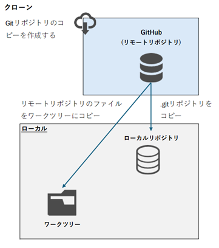

# ローカルリポジトリ作成

## 自分でプロジェクトを始める場合

コマンド
```
git init
```

実行例
```
>cd C:\Work
>git init
Initialized empty Git repository in C:/Work/.git/

>
```

   > [!NOTE]
   > git initを実行すると、.gitディレクトリが作成される。

## 他の人がすでに作成しているプロジェクトから始める場合（Gitリポジトリのコピーを作成する）



コマンド
```
git clone [リポジトリ名]
```

実行例
```
>cd C:\Work
>git clone https://github.com/MicrosoftDocs/m365copilot-docs.git
Cloning into 'm365copilot-docs'...
remote: Enumerating objects: 21555, done.
remote: Counting objects: 100% (4154/4154), done.
remote: Compressing objects: 100% (660/660), done.
remote: Total 21555 (delta 3700), reused 3838 (delta 3488), pack-reused 17401 (from 2)
Receiving objects: 100% (21555/21555), 133.60 MiB | 10.36 MiB/s, done.
Resolving deltas: 100% (15370/15370), done.

>dir
 ドライブ C のボリューム ラベルは Windows-SSD です
 ボリューム シリアル番号は E88C-B4CD です

 C:\Work のディレクトリ

2025/12/28  14:03    <DIR>          .
2025/12/28  14:02    <DIR>          ..
2025/12/28  14:03    <DIR>          m365copilot-docs
               0 個のファイル                   0 バイト
               3 個のディレクトリ  356,631,515,136 バイトの空き領域

>dir m365copilot-docs
 ドライブ C のボリューム ラベルは Windows-SSD です
 ボリューム シリアル番号は E88C-B4CD です

 \m365copilot-docs のディレクトリ

2025/12/28  14:03    <DIR>          .
2025/12/28  14:03    <DIR>          ..
2025/12/28  14:03             2,248 .acrolinx-config.edn
2025/12/28  14:03                73 .editorconfig
2025/12/28  14:03               419 .gitattributes
2025/12/28  14:03    <DIR>          .github
2025/12/28  14:03               156 .gitignore
2025/12/28  14:03               192 .markdownlint.json
2025/12/28  14:03             1,232 .openpublishing.publish.config.json
2025/12/28  14:03    <DIR>          .vscode
2025/12/28  14:03             3,578 agent-template-career-coach.md
2025/12/28  14:03             3,864 CONTRIBUTING.md
2025/12/28  14:03             3,288 cspell.json
2025/12/28  14:03    <DIR>          docs
2025/12/28  14:03            19,035 LICENSE
2025/12/28  14:03             1,106 LICENSE-CODE
2025/12/28  14:03               670 README.md
2025/12/28  14:03    <DIR>          redirects
2025/12/28  14:03    <DIR>          scripts
2025/12/28  14:03             2,782 SECURITY.md
2025/12/28  14:03    <DIR>          templates
2025/12/28  14:03             1,235 ThirdPartyNotices.md
              14 個のファイル              39,878 バイト
               8 個のディレクトリ  356,631,449,600 バイトの空き領域

>
```

