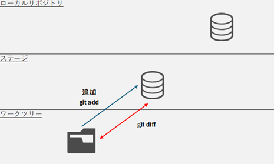

# 変更のステージ追加

## ワークツリーからステージへのファイルの登録



コマンド
```
git add [ファイル名] [ディレクトリ名]
```

実行例
```
>git add index.html
>git status
On branch master

No commits yet

Changes to be committed:
  (use "git rm --cached <file>..." to unstage)
        new file:   index.html

>
```
