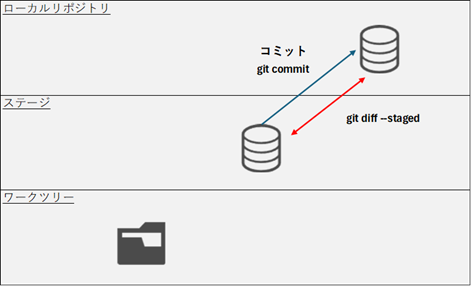

# 変更の記録

## ローカルリポジトリにファイルの変更を記録する



コマンド
```
git commit
git commit -m "メッセージ"
git commit -v
```

実行例
```
>git commit
[master (root-commit) 030bef8] git commit
 1 file changed, 1 insertion(+)
 create mode 100644 index.html

>git status
On branch master
nothing to commit, working tree clean

>
```
