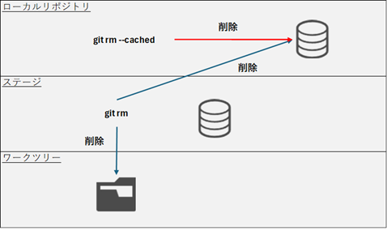

# ファイルの削除

## ファイル削除



コマンド
```
# ファイル/ディレクトリ削除
git rm [ファイル名]
git rm -r [ディレクトリ名]

# ファイルを残したい場合（gitの記録のみ削除する）
git rm --cached [ファイル名]
```

実行例
```
>git status
On branch master
nothing to commit, working tree clean

>dir
 ドライブ C のボリューム ラベルは Windows-SSD です
 ボリューム シリアル番号は E88C-B4CD です

 C:\Work のディレクトリ

2025/12/28  15:54    <DIR>          .
2025/12/28  16:11    <DIR>          ..
2025/12/28  15:54                12 index.html
               1 個のファイル                  12 バイト
               2 個のディレクトリ  356,492,075,008 バイトの空き領域

>git rm index.html
rm 'index.html'

>git status
On branch master
Changes to be committed:
  (use "git restore --staged <file>..." to unstage)
        deleted:    index.html


>dir
 ドライブ C のボリューム ラベルは Windows-SSD です
 ボリューム シリアル番号は E88C-B4CD です

 C:\Work のディレクトリ

2025/12/28  16:17    <DIR>          .
2025/12/28  16:11    <DIR>          ..
               0 個のファイル                   0 バイト
               2 個のディレクトリ  356,492,005,376 バイトの空き領域

>
```
