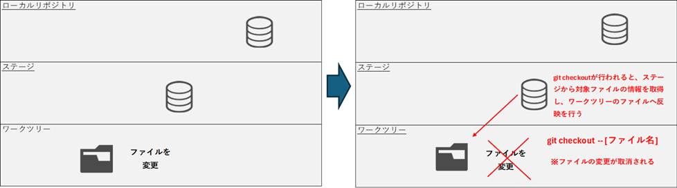
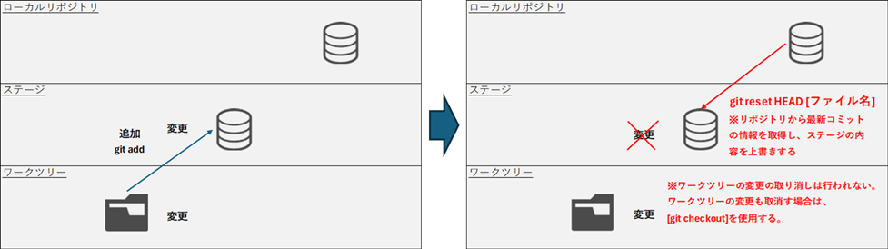
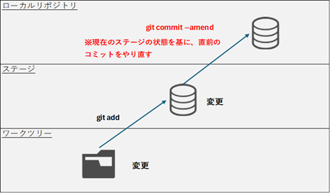

# 変更の取り消し

## ワークツリーの変更を取り消す



### 【旧】ワークツリーの変更を取り消す

コマンド
```
git checkout -- [ファイル名]
git checkout -- [ディレクトリ名]
```

実行例
```
>git status
On branch master
Your branch is ahead of 'origin/master' by 1 commit.
  (use "git push" to publish your local commits)

Changes not staged for commit:
  (use "git add <file>..." to update what will be committed)
  (use "git restore <file>..." to discard changes in working directory)
        modified:   index.html

no changes added to commit (use "git add" and/or "git commit -a")

>git checkout -- index.html

>git status
On branch master
Your branch is ahead of 'origin/master' by 1 commit.
  (use "git push" to publish your local commits)

nothing to commit, working tree clean

>
```

### 【新】ワークツリーの変更を取り消す

コマンド
```
git restore [ファイル名]
git restore [ディレクトリ名]
```

実行例
```
>notepad index.html

>git status
On branch master
Your branch is ahead of 'origin/master' by 1 commit.
  (use "git push" to publish your local commits)

Changes not staged for commit:
  (use "git add <file>..." to update what will be committed)
  (use "git restore <file>..." to discard changes in working directory)
        modified:   index.html

no changes added to commit (use "git add" and/or "git commit -a")

>git restore index.html

>git status
On branch master
Your branch is ahead of 'origin/master' by 1 commit.
  (use "git push" to publish your local commits)

nothing to commit, working tree clean

>
```

## ステージの変更を取り消す



### 【旧】ステージの変更を取り消す

コマンド
```
git reset HEAD [ファイル名]
git reset HEAD [ディレクトリ名]
```

実行例
```
>notepad index.html

>git status
On branch master
Your branch is ahead of 'origin/master' by 1 commit.
  (use "git push" to publish your local commits)

Changes not staged for commit:
  (use "git add <file>..." to update what will be committed)
  (use "git restore <file>..." to discard changes in working directory)
        modified:   index.html

no changes added to commit (use "git add" and/or "git commit -a")

>git diff
diff --git a/index.html b/index.html
index 82571e1..4482864 100644
--- a/index.html
+++ b/index.html
@@ -1 +1,3 @@
-<p>test</p>
\ No newline at end of file
+<p>test</p>
+<p>git reset</p>
+

>git add .

>git status
On branch master
Your branch is ahead of 'origin/master' by 1 commit.
  (use "git push" to publish your local commits)

Changes to be committed:
  (use "git restore --staged <file>..." to unstage)
        modified:   index.html

>git reset HEAD index.html
Unstaged changes after reset:
M       index.html

>git status
On branch master
Your branch is ahead of 'origin/master' by 1 commit.
  (use "git push" to publish your local commits)

Changes not staged for commit:
  (use "git add <file>..." to update what will be committed)
  (use "git restore <file>..." to discard changes in working directory)
        modified:   index.html

no changes added to commit (use "git add" and/or "git commit -a")

>git checkout -- index.html

>git status
On branch master
Your branch is ahead of 'origin/master' by 1 commit.
  (use "git push" to publish your local commits)

nothing to commit, working tree clean

>
```

### 【新】ステージの変更を取り消す

コマンド
```
git restore --staged [ファイル名]
git restore --staged [ディレクトリ名]
```

実行例
```
>notepad index.html

>git status
On branch master
Your branch is ahead of 'origin/master' by 1 commit.
  (use "git push" to publish your local commits)

Changes not staged for commit:
  (use "git add <file>..." to update what will be committed)
  (use "git restore <file>..." to discard changes in working directory)
        modified:   index.html

no changes added to commit (use "git add" and/or "git commit -a")

>git diff
diff --git a/index.html b/index.html
index 82571e1..59c4d0a 100644
--- a/index.html
+++ b/index.html
@@ -1 +1,2 @@
-<p>test</p>
\ No newline at end of file
+<p>test</p>
+<p>test2</p>
\ No newline at end of file

>git add .

>git status
On branch master
Your branch is ahead of 'origin/master' by 1 commit.
  (use "git push" to publish your local commits)

Changes to be committed:
  (use "git restore --staged <file>..." to unstage)
        modified:   index.html

>git restore --staged index.html

>git status
On branch master
Your branch is ahead of 'origin/master' by 1 commit.
  (use "git push" to publish your local commits)

Changes not staged for commit:
  (use "git add <file>..." to update what will be committed)
  (use "git restore <file>..." to discard changes in working directory)
        modified:   index.html

no changes added to commit (use "git add" and/or "git commit -a")

>git restore index.html

>git status
On branch master
Your branch is ahead of 'origin/master' by 1 commit.
  (use "git push" to publish your local commits)

nothing to commit, working tree clean

>
```

## コミットの変更を取り消す

直前のコミットを修正する場合はgit commit --amendを使用する。  
2つ以上前のコミットを修正する場合はgit rebaseを使用する。  



git commit --amendでは以下を行うことができる
- コミットメッセージの修正
- コミット内容を後から追加（git addし忘れてたファイルがあった場合に追加でコミットする）

### 直前のコミットをやり直す

コマンド
```
git commit --amend
```

実行例
```
>notepad index.html

>git add .

>git commit
[master 106b173] git commit --amendを追記
 1 file changed, 2 insertions(+), 1 deletion(-)

>git log -p -n 1
commit 106b1736155fd6fc847a4f2b71febc7e5e98e967 (HEAD -> master)
Author: lm14adgp <lm14adgp@gmail.com>
Date:   Mon Dec 29 09:27:30 2025 +0900

    git commit --amendを追記

diff --git a/index.html b/index.html
index 82571e1..59c4d0a 100644
--- a/index.html
+++ b/index.html
@@ -1 +1,2 @@
-<p>test</p>
\ No newline at end of file
+<p>test</p>
+<p>test2</p>
\ No newline at end of file

>notepad index.html

>git add .

>git commit --amend
[master e23e5c8] git commit --amendを追記
 Date: Mon Dec 29 09:27:30 2025 +0900
 1 file changed, 2 insertions(+), 1 deletion(-)

>git log -p -n 1
commit e23e5c86d3f41e12efc0b1628c6228c8ec0400c9 (HEAD -> master)
Author: lm14adgp <lm14adgp@gmail.com>
Date:   Mon Dec 29 09:27:30 2025 +0900

    git commit --amendを追記

diff --git a/index.html b/index.html
index 82571e1..5ed651c 100644
--- a/index.html
+++ b/index.html
@@ -1 +1,2 @@
-<p>test</p>
\ No newline at end of file
+<p>test</p>
+<p>test3</p>
\ No newline at end of file

>git status
On branch master
Your branch is ahead of 'origin/master' by 2 commits.
  (use "git push" to publish your local commits)

nothing to commit, working tree clean

>
```

### コミットメッセージの修正

コマンド
```
git commit --amend -m "メッセージ"
```

実行例
```
>git add index.html

>git commit -m "コミットSample"
[master dbc595b] コミットSample
 1 file changed, 1 insertion(+), 1 deletion(-)

>git log --oneline
dbc595b (HEAD -> master) コミットSample
acfe0e0 護持を
e23e5c8 git commit --amendを追記
b5ba0c9 test
030bef8 (origin/master) git commit

>git commit --amend -m "コミットTest"
[master 2764d67] コミットTest
 Date: Mon Dec 29 09:34:17 2025 +0900
 1 file changed, 1 insertion(+), 1 deletion(-)

>git log --oneline
2764d67 (HEAD -> master) コミットTest
acfe0e0 護持を
e23e5c8 git commit --amendを追記
b5ba0c9 test
030bef8 (origin/master) git commit

>
```

### コミット内容を後から追加

実行例
- コミット後に追加で修正を行った
- git addし忘れたファイルがあった
- 一時コミットを残したくない
```
>echo ^<^p^>test^<^/p^> > index.html

>echo ^<^p^>test2^<^/p^> > index2.html

>git add index.html

>git commit -m "index1とindex2を修正"
[master 8365eba] index1とindex2を修正
 1 file changed, 1 insertion(+), 2 deletions(-)

>git status
On branch master
Your branch is ahead of 'origin/master' by 5 commits.
  (use "git push" to publish your local commits)

Untracked files:
  (use "git add <file>..." to include in what will be committed)
        index2.html

nothing added to commit but untracked files present (use "git add" to track)

>git add index2.html

>git commit --amend --no-edit
[master 4b9d3e9] index1とindex2を修正
 Date: Mon Dec 29 09:44:07 2025 +0900
 2 files changed, 2 insertions(+), 2 deletions(-)
 create mode 100644 index2.html

>git status
On branch master
Your branch is ahead of 'origin/master' by 5 commits.
  (use "git push" to publish your local commits)

nothing to commit, working tree clean

>git log --oneline
4b9d3e9 (HEAD -> master) index1とindex2を修正
2764d67 コミットTest
acfe0e0 護持を
e23e5c8 git commit --amendを追記
b5ba0c9 test
030bef8 (origin/master) git commit

>
```