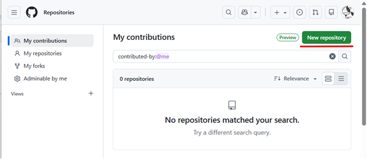
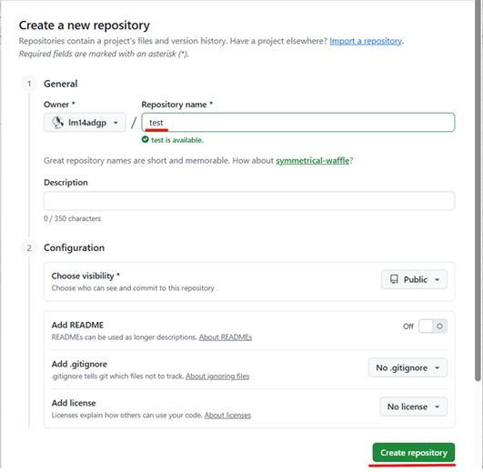
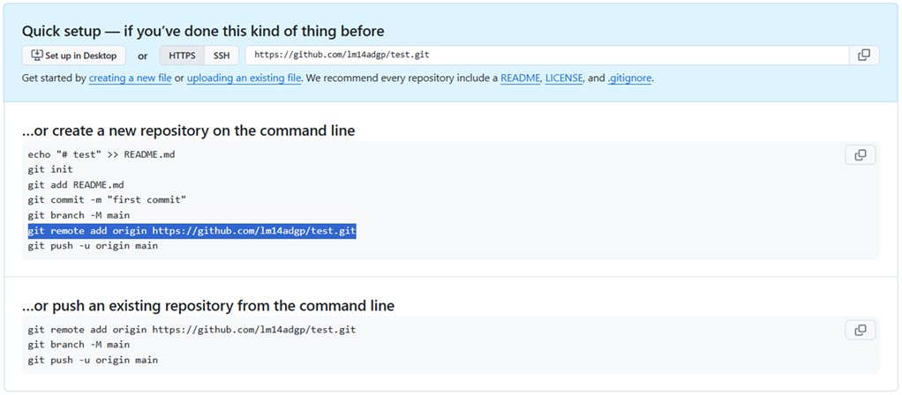

# リモートリポジトリ(GitHub)の作成

## GitHubでリモートリポジトリを作成する

GitHubにサインインし、 **New repository**を選択する。




 **Repository Name**を入力して、**Create repository**を実行する。





## リモートリポジトリ(GitHub)を新規追加する

コマンド
```
git remote add origin [URL]
```

   > [!NOTE]
   > [origin]というリモートリポジトリ名でURLのリモートリポジトリを登録する。

実行例
```
>git remote add origin https://github.com/lm14adgp/test.git
>
```