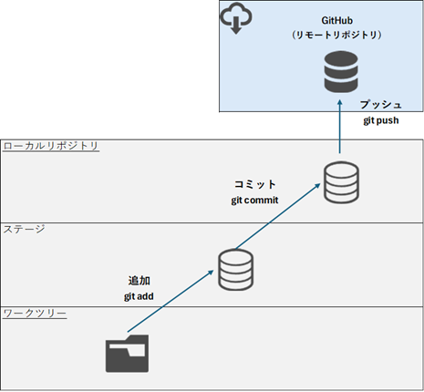

# リモートリポジトリへのプッシュ

## プッシュ（push）
ローカルリポジトリで作成・保存したコミット（変更履歴）をリモートリポジトリ（GitHubなど）にアップロードする。



コマンド
```
# ファイル/ディレクトリ削除
git push [リモート名] [ブランチ名]

# 初回に-uオプションでpushすると、次回以降にorigin masterをpushする際に「git push」のみで可能となる
git push -u [リモート名] [ブランチ名]
```

実行例
```
>git push -u origin master
Enumerating objects: 3, done.
Counting objects: 100% (3/3), done.
Writing objects: 100% (3/3), 216 bytes | 216.00 KiB/s, done.
Total 3 (delta 0), reused 0 (delta 0), pack-reused 0 (from 0)
To https://github.com/lm14adgp/test.git
 * [new branch]      master -> master
branch 'master' set up to track 'origin/master'.

>
```

リモートリポジトリに存在しないブランチをpushした場合、リモートリポジトリに対象のブランチが作成される
```
>git branch -a
* feature
  master
  remotes/origin/HEAD -> origin/master
  remotes/origin/master

>git push origin feature
Enumerating objects: 29, done.
Counting objects: 100% (27/27), done.
Delta compression using up to 12 threads
Compressing objects: 100% (12/12), done.
Writing objects: 100% (23/23), 1.98 KiB | 289.00 KiB/s, done.
Total 23 (delta 2), reused 0 (delta 0), pack-reused 0 (from 0)
remote: Resolving deltas: 100% (2/2), done.
remote:
remote: Create a pull request for 'feature' on GitHub by visiting:
remote:      https://github.com/lm14adgp/test/pull/new/feature
remote:
To https://github.com/lm14adgp/test.git
 * [new branch]      feature -> feature

>git branch -a
* feature
  master
  remotes/origin/HEAD -> origin/master
  remotes/origin/feature
  remotes/origin/master

>
```