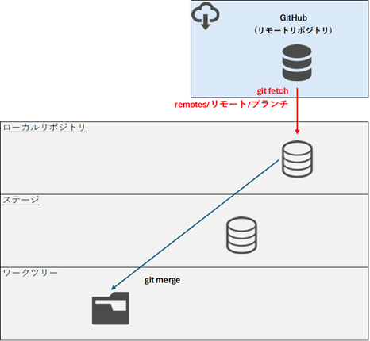
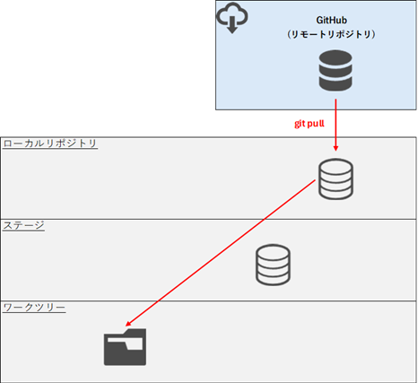

# リモートリポジトリの情報取得

## フェッチ（fetch）
リモートリポジトリ（GitHubなど）の最新のブランチやタグの情報をローカルリポジトリにダウンロードする。  
情報を取得するだけでローカルの作業ブランチには自動で反映（マージ）されない。



コマンド
```
git fetch [リモート名]
```

実行例
- git fetchの実行
```
>git remote
origin

>git fetch origin
remote: Enumerating objects: 4, done.
remote: Counting objects: 100% (4/4), done.
remote: Compressing objects: 100% (2/2), done.
remote: Total 3 (delta 0), reused 0 (delta 0), pack-reused 0 (from 0)
Unpacking objects: 100% (3/3), 932 bytes | 186.00 KiB/s, done.
From https://github.com/lm14adgp/test
   030bef8..5daf8dd  master     -> origin/master

>git branch -a
* master
  remotes/origin/HEAD -> origin/master
  remotes/origin/master

>dir
 ドライブ C のボリューム ラベルは Windows-SSD です
 ボリューム シリアル番号は E88C-B4CD です

 C:\Work のディレクトリ

2025/12/29  09:43    <DIR>          .
2025/12/29  11:06    <DIR>          ..
2025/12/29  09:43                14 index.html
2025/12/29  09:43                15 index2.html
               2 個のファイル                  29 バイト
               2 個のディレクトリ  359,840,165,888 バイトの空き領域

```

- git checkoutを行い、ブランチを介さずにHEADが直接リモートリポジトリの指すコミットファイルを参照する(home.htmlが存在すること)
- git checkoutを行い、HEADを元のmasterに戻す
- git merge origin/masterを行い、リモートブランチ(※1)をmasterブランチにマージする  
(※1) リモートブランチについては、XXXを参照

```
>git checkout remotes/origin/master
Note: switching to 'remotes/origin/master'.

You are in 'detached HEAD' state. You can look around, make experimental
changes and commit them, and you can discard any commits you make in this
state without impacting any branches by switching back to a branch.

If you want to create a new branch to retain commits you create, you may
do so (now or later) by using -c with the switch command. Example:

  git switch -c <new-branch-name>

Or undo this operation with:

  git switch -

Turn off this advice by setting config variable advice.detachedHead to false

HEAD is now at 5daf8dd Create home.html

>dir
 ドライブ C のボリューム ラベルは Windows-SSD です
 ボリューム シリアル番号は E88C-B4CD です

 C:\Work のディレクトリ

2025/12/29  11:31    <DIR>          .
2025/12/29  11:06    <DIR>          ..
2025/12/29  11:31                13 home.html
2025/12/29  11:31                12 index.html
               2 個のファイル                  25 バイト
               2 個のディレクトリ  359,836,860,416 バイトの空き領域

>git checkout master
Previous HEAD position was 5daf8dd Create home.html
Switched to branch 'master'
Your branch and 'origin/master' have diverged,
and have 5 and 1 different commits each, respectively.
  (use "git pull" if you want to integrate the remote branch with yours)

>git merge origin/master
Merge made by the 'ort' strategy.
 home.html | 1 +
 1 file changed, 1 insertion(+)
 create mode 100644 home.html

>dir
 ドライブ C のボリューム ラベルは Windows-SSD です
 ボリューム シリアル番号は E88C-B4CD です

 C:\Work のディレクトリ

2025/12/29  11:33    <DIR>          .
2025/12/29  11:06    <DIR>          ..
2025/12/29  11:33                13 home.html
2025/12/29  11:33                14 index.html
2025/12/29  11:33                15 index2.html
               3 個のファイル                  42 バイト
               2 個のディレクトリ  359,833,165,824 バイトの空き領域

>
```

## プル（pull）
リモートリポジトリ(GitHub)の最新の変更をローカルリポジトリにダウンロードし、自動的に現在のブランチに統合（merge）する。



コマンド
```
git pull [リモート名] [プランチ名]

# 下記コマンドと同じこと
git fetch origin master
git merge origin/master
```

実行例
```
>dir
 ドライブ C のボリューム ラベルは Windows-SSD です
 ボリューム シリアル番号は E88C-B4CD です

 C:\Work のディレクトリ

2025/12/29  11:33    <DIR>          .
2025/12/29  11:54    <DIR>          ..
2025/12/29  11:33                13 home.html
2025/12/29  11:33                14 index.html
2025/12/29  11:33                15 index2.html
               3 個のファイル                  42 バイト
               2 個のディレクトリ  359,894,650,880 バイトの空き領域

>git branch -a
* master
  remotes/origin/HEAD -> origin/master
  remotes/origin/master

>git pull origin master
remote: Enumerating objects: 4, done.
remote: Counting objects: 100% (4/4), done.
remote: Compressing objects: 100% (2/2), done.
remote: Total 3 (delta 0), reused 0 (delta 0), pack-reused 0 (from 0)
Unpacking objects: 100% (3/3), 958 bytes | 136.00 KiB/s, done.
From https://github.com/lm14adgp/test
 * branch            master     -> FETCH_HEAD
   5daf8dd..0dc1b20  master     -> origin/master
Merge made by the 'ort' strategy.
 test.html | 1 +
 1 file changed, 1 insertion(+)
 create mode 100644 test.html

>dir
 ドライブ C のボリューム ラベルは Windows-SSD です
 ボリューム シリアル番号は E88C-B4CD です

 C:\Work のディレクトリ

2025/12/29  11:57    <DIR>          .
2025/12/29  11:54    <DIR>          ..
2025/12/29  11:33                13 home.html
2025/12/29  11:33                14 index.html
2025/12/29  11:33                15 index2.html
2025/12/29  11:57                13 test.html
               4 個のファイル                  55 バイト
               2 個のディレクトリ  359,893,663,744 バイトの空き領域
>
```