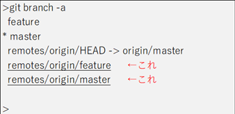
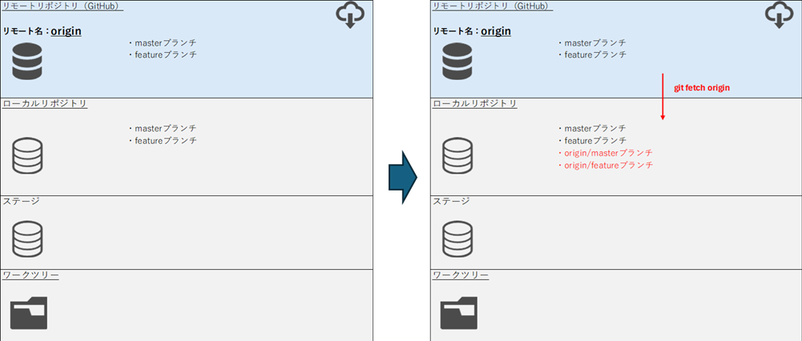

# リモートブランチとは

## リモートブランチ

リモートブランチ(上記赤字)は、リモートリポジトリにあるブランチの状態をローカルで保持しておくための、リモート追跡ブランチ。

■前提
| 項目                 | 説明                           |
|----------------------|-------------------------------|
| **origin**         | リモートリポジトリの名称           |
| **origin/master**  | リモートリポジトリ「origin」のブランチ「master」を追跡するブランチ |
| **master**        | ブランチの名称                      |

git fetch originを行うとリモートリポジトリ「origin」の全ブランチの状況をとってくる。  
これはリモートリポジトリのコミットファイルをローカルに保存するのと同時に、ブランチを「origin/ブランチ名」という形で作成する。  
git fetch後に、mergeを行う際に「git merge origin/master」とするのは、フェッチしたmasterブランチの内容はorigin/masterで参照できるため。

