# 開発の流れ

## プルリクエストの流れ

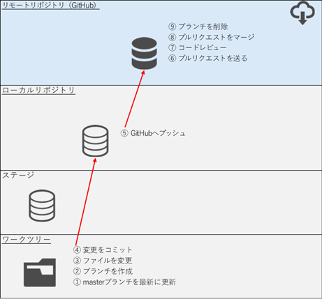

### ①masterブランチを最新の状態にする

コマンド
```
>git branch
  feature
* master

>git fetch origin

>git branch -a
  feature
* master
  remotes/origin/HEAD -> origin/master
  remotes/origin/feature
  remotes/origin/master

>git merge origin/master
Already up to date.

>git status
On branch master
Your branch is ahead of 'origin/master' by 9 commits.
  (use "git push" to publish your local commits)

nothing to commit, working tree clean

>
```

### ②新規ブランチ作成～③ファイル変更～④コミット

コマンド
```
>git switch -c pull_request
Switched to a new branch 'pull_request'

>dir
 ドライブ C のボリューム ラベルは Windows-SSD です
 ボリューム シリアル番号は E88C-B4CD です

 C:\Work のディレクトリ

2025/12/29  21:21    <DIR>          .
2025/12/30  10:41    <DIR>          ..
2025/12/29  21:21                17 feature.html
2025/12/29  11:33                13 home.html
2025/12/29  11:33                14 index.html
2025/12/29  11:33                15 index2.html
2025/12/29  11:57                13 test.html
               5 個のファイル                  72 バイト
               2 個のディレクトリ  359,415,373,824 バイトの空き領域

>echo ^<^p^>pull request^<^/p^> >> index.html

>git status
On branch pull_request
Changes not staged for commit:
  (use "git add <file>..." to update what will be committed)
  (use "git restore <file>..." to discard changes in working directory)
        modified:   index.html

no changes added to commit (use "git add" and/or "git commit -a")

>git add index.html

>git commit
[pull_request 61bbac2] pull requestを追記
 1 file changed, 1 insertion(+)

>git status
On branch pull_request
nothing to commit, working tree clean

>
```

### ⑤GitHubへプッシュ

コマンド
```
>git push origin pull_request
Enumerating objects: 9, done.
Counting objects: 100% (9/9), done.
Delta compression using up to 12 threads
Compressing objects: 100% (4/4), done.
Writing objects: 100% (6/6), 634 bytes | 634.00 KiB/s, done.
Total 6 (delta 1), reused 0 (delta 0), pack-reused 0 (from 0)
remote: Resolving deltas: 100% (1/1), done.
remote:
remote: Create a pull request for 'pull_request' on GitHub by visiting:
remote:      https://github.com/lm14adgp/test/pull/new/pull_request
remote:
To https://github.com/lm14adgp/test.git
 * [new branch]      pull_request -> pull_request

>
```

### ⑥プルリクエストを送る

「Pull requests」を選択する  
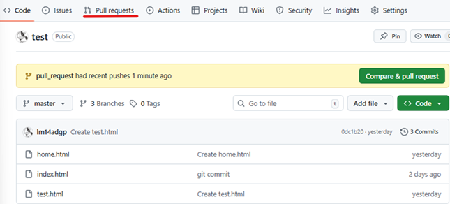

「New pull request」を選択する  


baseに「master」を指定し、compareに「pull_request」を指定する。（pull_requestブランチからmasterブランチへプルリクエストを送る）  
  
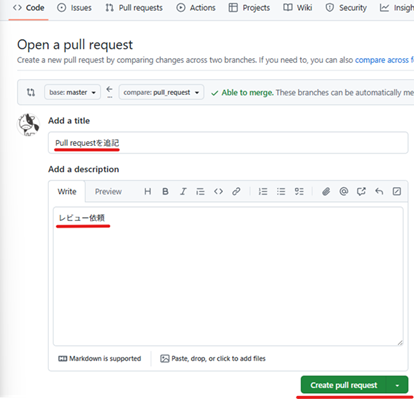

### ⑦ コードレビュー

【レビュアー】レビュー依頼を行う  
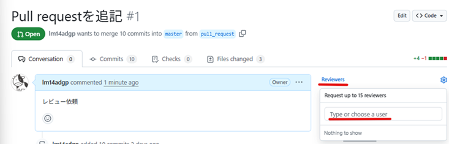  

【レビュイー】レビューを行う  
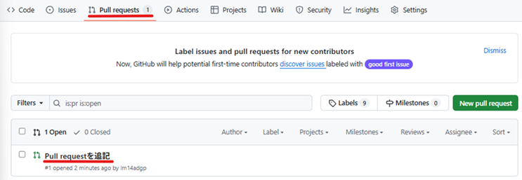  
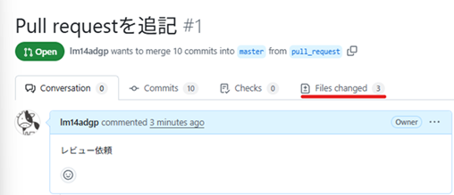  
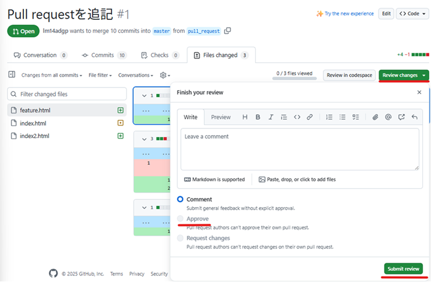  

### ⑧ プルリクエストをマージ

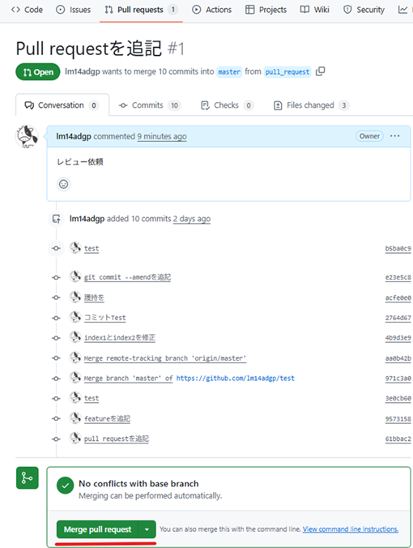  
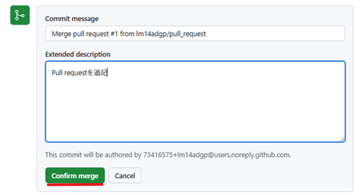  
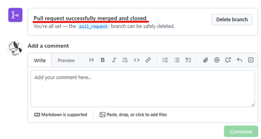  

### ⑨ブランチを削除

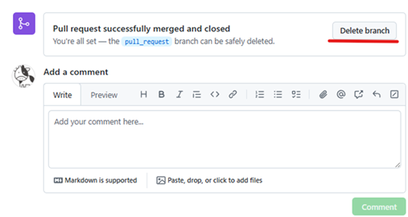  
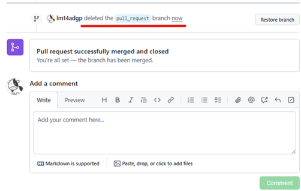  
!

ローカルにリモートリポジトリの内容を反映する。  

コマンド
```
>git switch master
Switched to branch 'master'
Your branch is ahead of 'origin/master' by 9 commits.
  (use "git push" to publish your local commits)

>git branch
  feature
* master
  pull_request

>git pull origin master
remote: Enumerating objects: 1, done.
remote: Counting objects: 100% (1/1), done.
remote: Total 1 (delta 0), reused 0 (delta 0), pack-reused 0 (from 0)
Unpacking objects: 100% (1/1), 913 bytes | 456.00 KiB/s, done.
From https://github.com/lm14adgp/test
 * branch            master     -> FETCH_HEAD
   0dc1b20..90f6623  master     -> origin/master
Updating 9573158..90f6623
Fast-forward
 index.html | 1 +
 1 file changed, 1 insertion(+)

>git branch -d pull_request
Deleted branch pull_request (was 61bbac2).

>git branch
  feature
* master

>
```